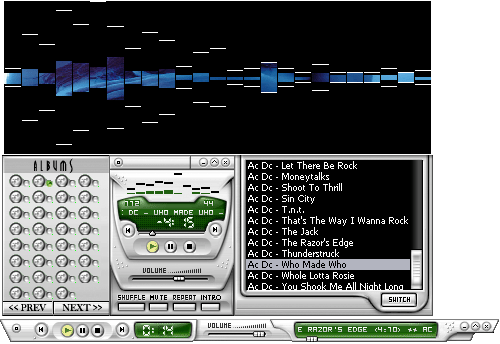



## \[           aAaA\_ MMPlayerX    \]

### Description

what's up KABRONES(AS), LA PORRA LOS SALUDA...

Music Mp3 Player X version 2.0. UPDATED(Nov-2004), search, order and play through albums mp3,

wma, wav, ogg files and show your cover front.

Full code here.

Support Skins, Languages, Karaoke function, Tag editor, Visualization Studio, Spectrum Analyzer, Equalizer 10 bands, Sound Effects,

Albums Browser, Covert Front Browser, Mini mode, Play List... and more functions...
 
### More Info
 

             |
---                |---
**Submitted On**   |2004-11-21 12:31:00
**By**             |[R@úL M@RtInEz](https://github.com/Planet-Source-Code/PSCIndex/blob/master/ByAuthor/r-l-m-rtinez.md)
**Level**          |Intermediate
**User Rating**    |4.9 (97 globes from 20 users)
**Compatibility**  |VB 5\.0, VB 6\.0
**Category**       |[Sound/MP3](https://github.com/Planet-Source-Code/PSCIndex/blob/master/ByCategory/sound-mp3__1-45.md)
**World**          |[Visual Basic](https://github.com/Planet-Source-Code/PSCIndex/blob/master/ByWorld/visual-basic.md)
**Archive File**   |[\[\_\_\_\_\_\_\_\_\_1823841212004\.zip](https://github.com/Planet-Source-Code/r-l-m-rtinez-aaaa-mmplayerx__1-57495/archive/master.zip)

